# Cloud Identity Threat Detection — Impossible Travel & Anomalous Sign-in Analysis

A SOC-style investigation project simulating cloud identity attacks (Microsoft
Entra ID sign-in patterns) using Splunk: detection engineering, investigation,
false-positive analysis, detection tuning, and incident response — end to end.

**Author:** Fatma Elzahraa Adel

## Why This Project

My previous projects (linked below) focused on endpoint-based attacks
(Meterpreter C2, brute force) detected via Sysmon and Windows Event Logs.
Most real-world compromises today start with **identity**, not an endpoint —
a stolen password used from an unexpected location is one of the most common
patterns a SOC analyst investigates. This project applies the same detection
engineering methodology from my earlier work to that different, and
increasingly critical, data source: cloud sign-in logs.

## Note on the Dataset
A live Microsoft 365 / Entra ID tenant was not accessible at the time of this
project (Microsoft's free developer sandbox program requires account
eligibility criteria that were not met, and the paid trial routes require a
credit card). To work around this, a synthetic sign-in log dataset was built
by hand, matching the **official Microsoft Entra ID sign-in log schema**
(fields such as `userPrincipalName`, `createdDateTime`, `ipAddress`,
`location`, `status.errorCode` — see [Microsoft Graph signIn resource
docs](https://learn.microsoft.com/en-us/graph/api/resources/signin)), with
realistic normal activity plus several deliberately embedded attack and
false-positive scenarios. All detection logic, investigation steps, and
findings below were produced against this dataset in Splunk exactly as they
would be against a live environment.

## Architecture

```
Synthetic Entra ID Sign-in Logs (CSV, matches official schema)
        ↓
    Splunk (index=cloud_identity)
        ↓
   4 Detection Rules (SPL)
        ↓
  Scheduled Alert (fires every 5 min)
        ↓
    Investigation (Timeline, IP Enrichment, MITRE mapping)
        ↓
  False Positive Analysis & Detection Tuning
        ↓
      Dashboard + Incident Ticket
```

### Data Import Validation
Sign-in log data was imported into Splunk (`index=cloud_identity`) and
verified for completeness against the source CSV.

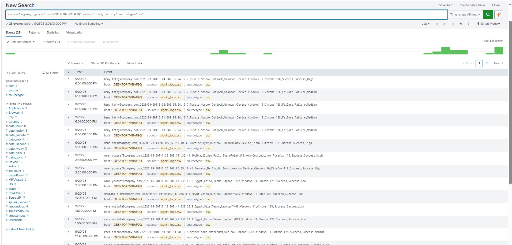
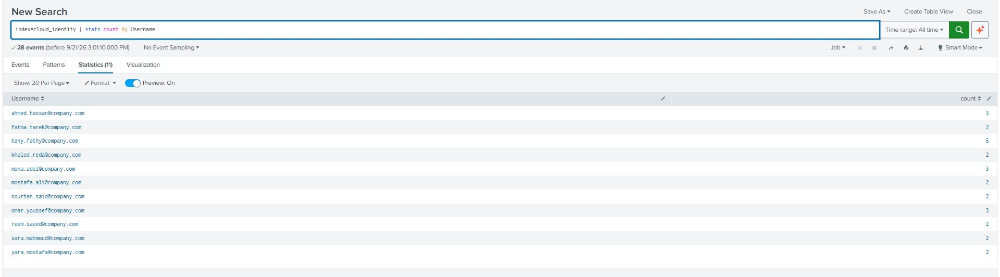

## Detections

| ID | Detection | MITRE ATT&CK | Result |
|---|---|---|---|
| 1 | Impossible Travel | T1078 | 4 alerts → 3 after tuning (0 false positives) |
| 2 | Multiple Countries (3+ in 1hr) | T1078 | 1 match (omar.youssef) |
| 3 | New Device + Unusual Location | T1078 | 3 matches |
| 4 | MFA Anomaly (fatigue pattern) | T1078, T1621 | 1 match (4 failures → 1 success) |

Full SPL queries: [`Detections/`](./Detections/)

**Detection 1 — Impossible Travel:**
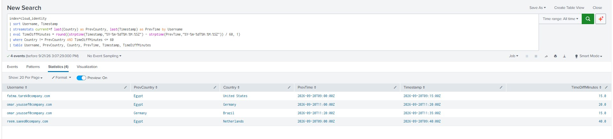

**Detection 2 — Multiple Countries:**
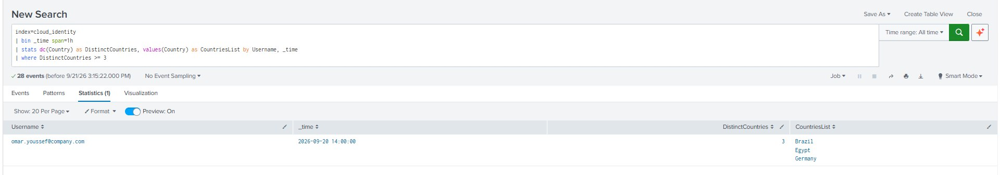

**Detection 3 — New Device + Unusual Location:**
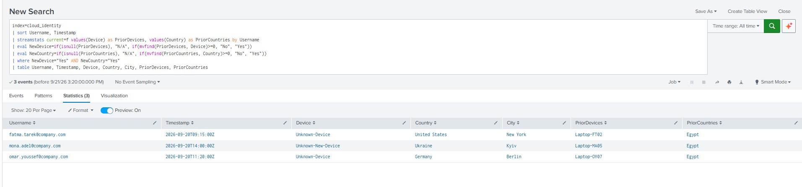

**Detection 4 — MFA Anomaly:**
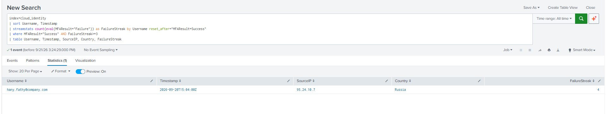

## False Positive Analysis
Two cases were investigated and confirmed benign — a corporate VPN exit
(`reem.saeed`) and a same-city GeoIP variance (`yara.mostafa`). Full
writeup: [`investigation/false_positive_analysis.md`](./investigation/false_positive_analysis.md)

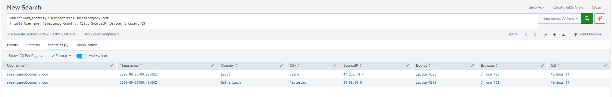
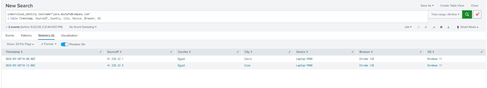

## Detection Tuning
The Impossible Travel rule was tuned after investigation to exclude a known
VPN IP, reducing false positives by 25% with zero loss of true-positive
coverage. Details: [`Detections/detection_tuning.md`](./Detections/detection_tuning.md)

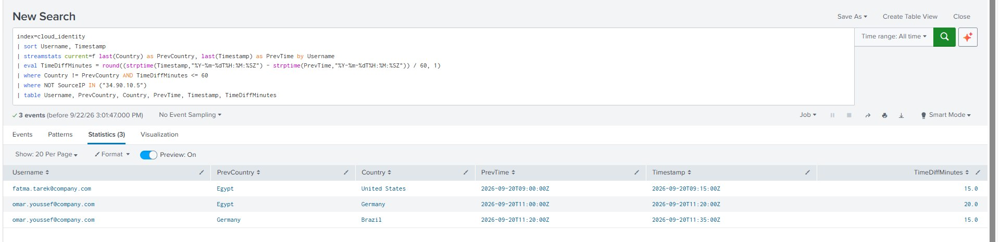

## Full Investigation Example
A complete triage walkthrough — timeline, IP/threat-intel enrichment via
VirusTotal, MITRE mapping, and severity assessment — was carried out for the
`fatma.tarek@company.com` case:
[`investigation/timeline_fatma_tarek.md`](./investigation/timeline_fatma_tarek.md)

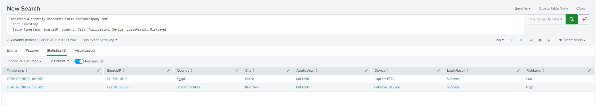

**IP Enrichment (VirusTotal):**

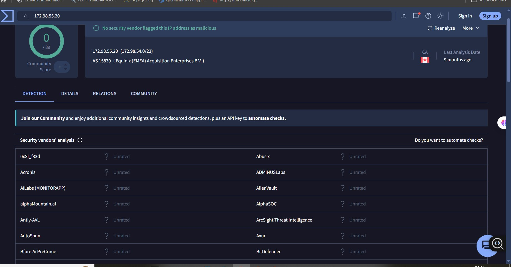
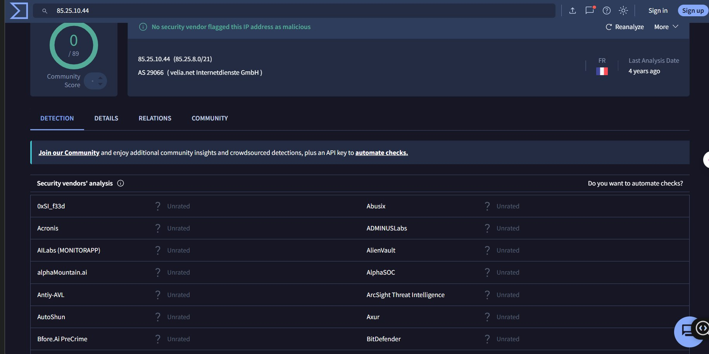

## Incident Ticket
The `fatma.tarek` case was documented as a formal SOC ticket, including
recommended containment and response actions:
[`incident-ticket.md`](./incident-ticket.md)

## Live Alert
Detection 1 was converted from an ad-hoc search into a real Splunk Scheduled
Alert (cron: every 5 minutes, "Add to Triggered Alerts" action), confirmed
firing in the Triggered Alerts log.

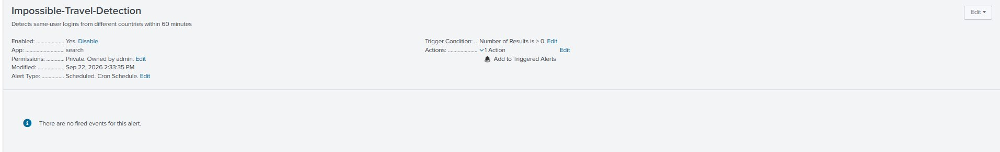
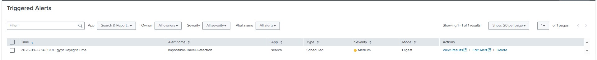

## Dashboard
A Splunk dashboard was built summarizing: total sign-ins, high-risk events,
sign-ins by country, top source IPs, MFA failures, and impossible-travel
alert count.

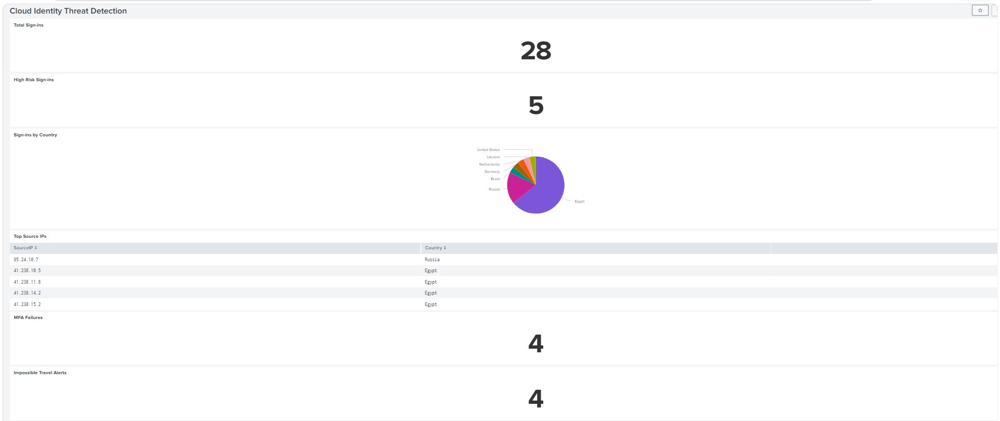

## Tools Used
Splunk Enterprise · SPL · VirusTotal · Microsoft Entra ID sign-in log schema
(reference) · Excel/CSV

## Repository Structure
```
├── README.md
├── Data/
│   └── signin_logs.csv
├── Detections/
│   ├── detection_1_impossible_travel.spl
│   ├── detection_2_multiple_countries.spl
│   ├── detection_3_new_device.spl
│   ├── detection_4_mfa_anomaly.spl
│   └── detection_tuning.md
├── investigation/
│   ├── timeline_fatma_tarek.md
│   ├── false_positive_analysis.md
│   └── mitre_attack_mapping.md
├── incident-ticket.md
└── screenshots/
```

## Related Projects
- [IR-Playbook-Meterpreter-C2-Detection](#) — endpoint-based C2 detection with Splunk + Sysmon
- [Splunk-SOC-Home-Lab](#) — brute-force detection and SOC dashboarding
- [Advanced-Detection-Engineering](#) — 10-scenario detection engineering lifecycle project

## Disclaimer
This project uses a synthetic dataset modeled on official Microsoft schema
documentation, built for educational and portfolio purposes. No real tenant,
accounts, or third-party infrastructure were involved.
